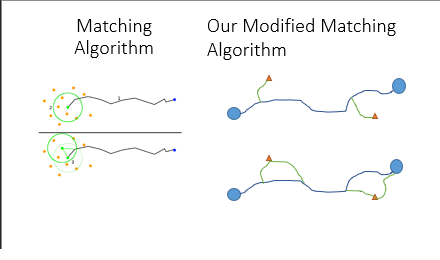

# CarPoolApp

Carpool app is an android based ride sharing app in which a user can either own a carpool or can request a carpool. Carpool owner selects his source and destination for his ride and can wait for a requester to join. Carpool requester selects source and destination on the map and can only see carpool rides in terms of the optimal route which is selected by a matching algorithm. Matching algorithm works as follows: 

1. Paper implemented algorithm in such a way where the requester are checked if there are within a circle drawn from source and destination with some radius. 
2. Polyline – is the optimal route from source to destination. 
3. Check if the requester’s source and destination is within the polylines tolerance (Tolerance is the physical route from any point on polyline to the a certain distance)
4. If the requesters is within the tolerances distance, then start finding the optimal route with requester as waypoint between carpool owners source and destination. 
5. And then display the owner’s carpool to the requester.

Features
=================

1. Login and Register page (Check for valid email address while registering)
2. Create user profile and the user can either be a owner (own a carpool) or requester (Request a carpool)
3. Carpool owner selects source and destination either on map or search the place and wait for a requester to join
4. Carpool requesters selects source and destination either on map or search the place and can only see carpool rides in terms of optimal route.
5. Matching algorithm provides the owner only the optimal requesters.
6. User can also chat with other user.

Project Contributors
===================

1. Gaurav Pathare
2. Niyati Shah
